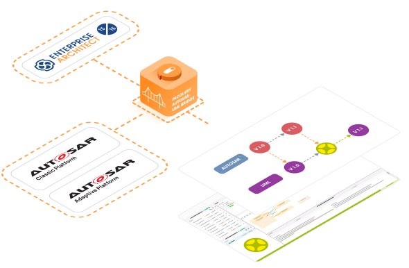

# Github Action to deploy and run the IncQuery AUTOSAR-UML Bridge

[](https://github.com/IncQueryLabs/incquery-suite-bridge-autosar-uml-action/actions/workflows/AutosarUmlActionExample.yml)

This repository contains a GitHub Action for deploying and running the IncQuery AUTOSAR-UML Bridge.
 The action works by donwloading and installing the IncQuery AUTOSAR-UML Bridge, but only if it's 
 not already present on the runner. Also, the installer is cached, to speed subsequent runs up.
 
The repository also contains a workflow example demonstrating how to use the action.

## What does the workflow do?

Firslty, using the provided action, the workflow executes a transformation on an input AUTOSAR model,
 adding corresponding elements to the specified Enterprise Architect model.
 Then, should this result in a change in the Enterprise Architect model, the result is pushed back onto the
 triggering branch.

## About the IncQuery AUTOSAR-UML Bridge

<p align="center">
  
</p>

This works for both documentation purposes, as well as handover automation between architecture and detailed design.
 The IncQuery AUTOSAR-UML Bridge creates UML elements for the complete AUTOSAR hierarchy, so that software component
 and sequence diagrams can be created easily.
 Its seamless integration with Sparx Systems Enterprise Architect helps to streamline the overall design process.

For more information visit [https://incquery.io/autosar-uml-bridge](https://incquery.io/autosar-uml-bridge).

## Usage

### Requirements

In case of GitHub hosted runner:
- windows-2022 (or newer) runner
- Valid license
- Credentials to access the **IncQuery AUTOSAR-UML Bridge** release

In case of self hosted runner:
- Runner hosted on Windows 10 x64 1803 April 2018 Update or newer
- Valid license
- Credentials to access the **IncQuery AUTOSAR-UML Bridge** or the Bridge being pre-installed on the runner

The following secrets need to be configured in the repository:
- If the IncQuery AUTOSAR-UML Bridge is not pre-installed on the runner:
 INCQUERY_USERNAME, INCQUERY_PASSWORD to access the Bridge releases
- INCQUERY_AUTOSAR_UML_INTEGRATION_LICENSE: contents of the license file as-is

### Example step

```yaml
- name: Run IncQuery AUTOSAR-UML Bridge
  uses: IncQueryLabs/incquery-suite-bridge-autosar-uml-action@v1
  with:
    arxml_folder_path: example-arxml
    ea_model_file_path: counting-logic.qeax
    incquery_username: "${{ secrets.INCQUERY_USERNAME }}"
    incquery_password: "${{ secrets.INCQUERY_PASSWORD }}"
    license: "${{ secrets.INCQUERY_AUTOSAR_UML_INTEGRATION_LICENSE }}"
```

See [AutosarUmlActionExample.yml](.github/workflows/AutosarUmlActionExample.yml) for an example of a full workflow.

### Parameters

#### arxml_folder_path

Path to the AUTOSAR model. Can point to a singe ARXML file, or a folder containing multiple ARXML files.
 This parameter is mandatory.

#### ea_model_file_path

Path to the Enterprise Architect model file, probably .eapx or .qeax.
 This parameter is mandatory.

#### incquery_username, incquery_password

Username and password to *artifacts.incquery.io*.
 If the runner does not have the Validator already installed, then these parameters are required.

#### license

Contents of the license file as-is. The AutosarUMLIntegration and AutosarUMLIntegrationCI license features are required.
 This parameter is mandatory.
